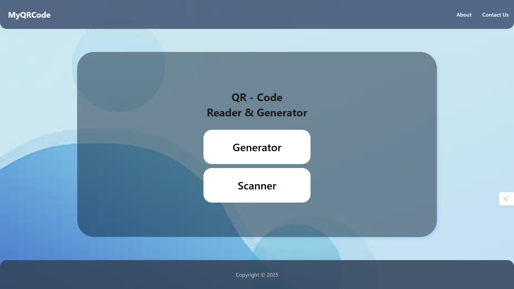
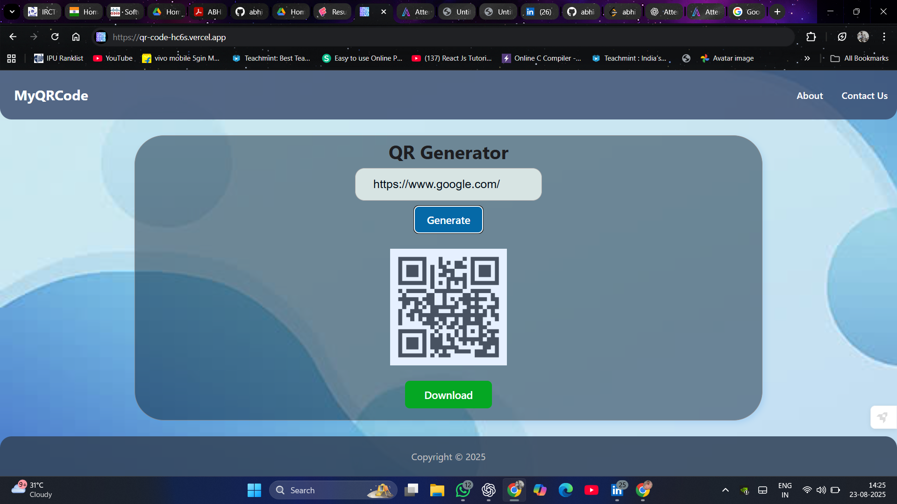
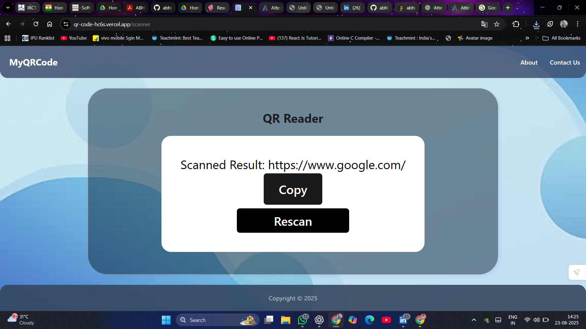

# 📱 QR Code Generator & Scanner


A simple yet powerful **QR Code Generator & Scanner** built with **React.js**.  
Generate and scan QR codes instantly with a clean and responsive UI.  


---

## 🚀 Features

| Feature | Description |
|---------|-------------|
| ✅ **QR Code Generator** | Create QR codes for text, links, and more. |
| ✅ **QR Code Scanner** | Scan QR codes in real-time using device camera. |
| ✅ **Responsive UI** | Works seamlessly on desktop, tablet, and mobile. |
| ✅ **Lightweight** | Built with React + minimal libraries for performance. |
| ✅ **Cross-Browser** | Compatible with all modern browsers. |

---

## 🖼️ Screenshots

👉 *(Add screenshots of generator & scanner here)*  

Example placeholders:  
  
  

---

## 🛠️ Tech Stack

- **Frontend:** React.js, JavaScript, CSS3  
- **Libraries:** `qrcode.react`, `react-qr-reader` (or whichever you used)  
- **Deployment:** Vercel  

---

## ⚙️ Installation & Setup

```bash
# Clone the repository
$ git clone https://github.com/biru-ka2/QR-Code.git

# Navigate to project folder
$ cd Qr-Code-app

# Install dependencies
$ npm install

# Start development server
$ npm start
